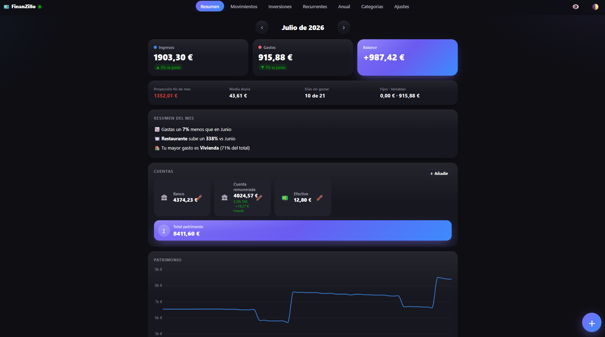
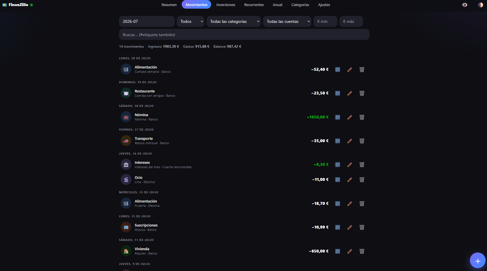
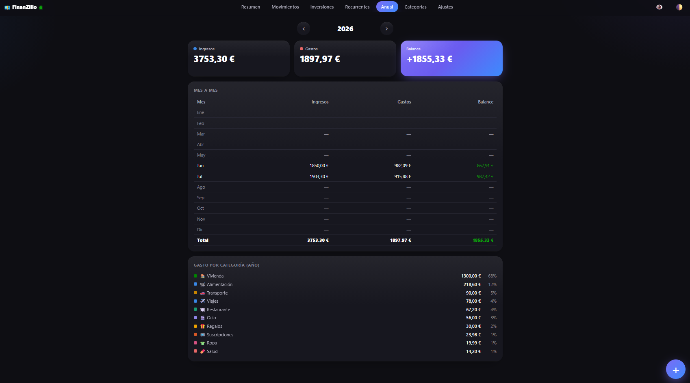
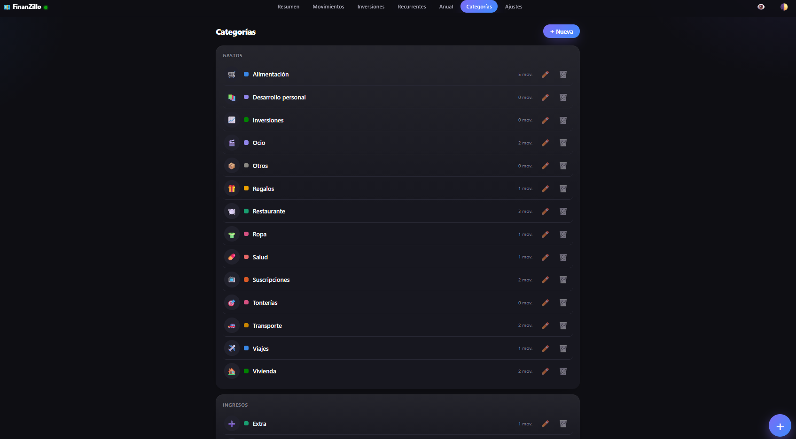
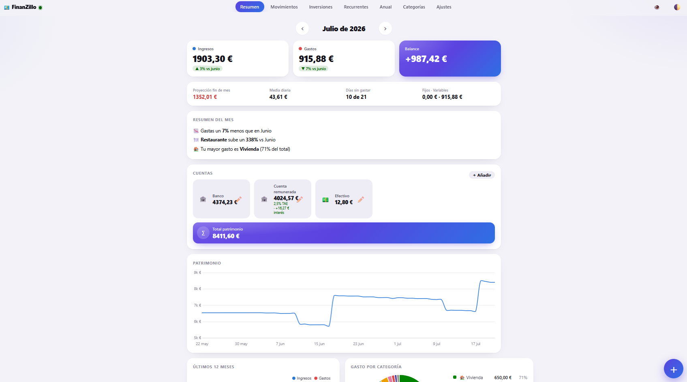

# 💶 FinanZillo

**Una app de control de gastos e ingresos que corre en tu propio ordenador.** Sin nube, sin cuentas de terceros, sin suscripción: tus datos viven en un único archivo SQLite en tu disco. La usas desde el navegador del PC y desde el móvil (se instala como app), y puedes apuntar gastos en dos toques con un atajo de iPhone.

Está pensada para **una sola persona** y en español/euros.



<sub>Todas las capturas usan datos de ejemplo, que puedes generar tú con `npm run seed:demo`.</sub>

### Qué trae

- **Resumen mensual**: ingresos, gastos y balance con comparativa contra el mes anterior, proyección de fin de mes, media diaria, días sin gastar, reparto fijos/variables e "insights" automáticos.
- **Gráficas**: evolución de 12 meses, reparto por categoría, ritmo de gasto acumulado, calendario de gasto por día y evolución del patrimonio.
- **Cuentas** con saldo calculado solo (incluido interés diario si es una cuenta remunerada) y **transferencias** entre ellas.
- **Inversiones** con precios en vivo (Yahoo Finance / CoinGecko, sin registrarte en nada), compras y ventas parciales.
- **Presupuestos** por categoría y global, **objetivos de ahorro**, **movimientos recurrentes** (gastos, ingresos, traspasos y aportaciones), **plantillas** y **etiquetas**.
- **Importar CSV** del banco y **exportar** a CSV.
- **Funciona sin conexión**: si el servidor está apagado, la app abre igual con los últimos datos y puedes seguir apuntando gastos; se envían solos cuando vuelve. Un LED en la barra superior te dice si el servidor responde.
- **Modo privacidad** (difumina los importes), tema claro y oscuro.

### Con qué está hecho

Node.js + Express + `node:sqlite` (el SQLite que ya trae Node, sin dependencias nativas que compilar). El frontend es HTML/CSS/JS a pelo, **sin build**: se edita y se recarga. La única dependencia es Express.

---

## Más capturas

| Movimientos | Vista anual |
|---|---|
| [](docs/img/movimientos.png) | [](docs/img/anual.png) |
| **Categorías** | **Tema claro** |
| [](docs/img/categorias.png) | [](docs/img/resumen-claro.png) |

---

## Índice

- [Requisitos](#requisitos)
- [Guía de instalación paso a paso](#guía-de-instalación-paso-a-paso)
  - [1 · Descargar y arrancar](#paso-1--descargar-y-arrancar)
  - [2 · Cambiar la contraseña](#paso-2--cambiar-la-contraseña-por-una-tuya)
  - [3 · Dejarla a tu gusto](#paso-3--dejarla-a-tu-gusto)
  - [4 · Que arranque sola al encender el PC](#paso-4--que-arranque-sola-al-encender-el-pc-windows)
  - [5 · Entrar desde el móvil en casa](#paso-5--entrar-desde-el-móvil-estando-en-casa)
  - [6 · Entrar desde fuera con Tailscale](#paso-6--entrar-desde-fuera-de-casa-tailscale)
  - [7 · Instalarla como app en el iPhone](#paso-7--instalarla-como-app-en-el-iphone)
  - [8 · Atajo de iPhone para apuntar gastos](#paso-8--atajo-de-iphone-para-apuntar-en-dos-toques)
  - [9 · Copias de seguridad](#paso-9--copias-de-seguridad)
- [Probarlo con datos de ejemplo](#probarlo-con-datos-de-ejemplo)
- [Estructura del proyecto](#estructura-del-proyecto)
- [API](#api)
- [Docker](#docker-alternativa)
- [Seguridad](#seguridad-en-corto)

---

## Requisitos

- **Node.js ≥ 22.5** (probado con Node 24). `node --version` para comprobarlo.
- Windows, macOS o Linux. Los pasos de arranque automático son de Windows.

---

## Guía de instalación paso a paso

### Paso 1 — Descargar y arrancar

```bash
git clone https://github.com/adrmoralf/FinanZillo.git
cd FinanZillo
npm install
npm start
```

> Si no usas git, en la página del repo: **Code → Download ZIP**, descomprime y abre una terminal dentro de la carpeta antes de `npm install`.

**No hay que crear ninguna cuenta ni registrarse.** La primera vez que arranca, la app detecta que no existe el archivo `.env` y **se genera sola las credenciales**: una contraseña aleatoria de 8 caracteres y un token de API de 48. Verás algo así en la consola:

```
[FinanZillo] Se ha creado .env con credenciales nuevas. Contraseña inicial: 74ad8f3e
FinanZillo escuchando en:
  Local:   http://localhost:3000
  Red:     http://<la-IP-de-tu-PC>:3000
```

(en el sitio de `<la-IP-de-tu-PC>` verás la IP real de tu equipo en tu red; apúntala, hace falta en el paso 5)

Abre <http://localhost:3000> y entra con esa contraseña.

> Si no la copiaste a tiempo, no pasa nada: está guardada en el archivo **`.env`** que se acaba de crear en la raíz del proyecto. Ábrelo con cualquier editor de texto.

### Paso 2 — Cambiar la contraseña por una tuya

Esa contraseña inicial es aleatoria e incómoda, así que cámbiala. **No se cambia desde la web: se edita el archivo `.env`** de la raíz del proyecto.

```env
# Configuración de FinanZillo. Cambia la contraseña por una tuya.
PASSWORD=la-que-tu-quieras
API_TOKEN=no-hace-falta-tocarlo
PORT=3000
```

Guarda el archivo y **reinicia la app** para que la coja:

- Si la arrancaste con `npm start`: `Ctrl+C` en esa consola y `npm start` otra vez.
- Si ya la tienes como tarea programada (paso 4): `schtasks /End /TN "FinanZillo"` y luego `schtasks /Run /TN "FinanZillo"`.

Cosas que conviene saber:

- **El `.env` es el único sitio donde vive la contraseña**, en texto plano. Es a propósito: la app es para una sola persona en su propia máquina, y poder leerla o cambiarla a mano vale más que guardar un hash. Si algún día la expones a internet, esto hay que replantearlo.
- **`.env` y `data/` están en `.gitignore`**: ni tus credenciales ni tus movimientos se suben nunca a git.
- **Cambiar la contraseña no cierra las sesiones ya abiertas** (la cookie se firma con un secreto aparte). Si quieres echar a todos los dispositivos que hayan entrado, borra también `data/.session-secret` y reinicia: se generará otro y todas las sesiones caducarán.
- El **`API_TOKEN`** es independiente y solo lo usan el atajo del iPhone y las llamadas a la API. No hace falta tocarlo; si lo cambias, actualiza también el atajo.
- ¿Perdiste el acceso? Borra el `.env` y arranca otra vez: la app creará uno nuevo con otra contraseña. **Tus datos no se tocan**, viven aparte en `data/finanzillo.db`.

### Paso 3 — Dejarla a tu gusto

Antes de empezar a usarla de verdad, en la propia web:

1. **Categorías**: vienen unas por defecto. Entra en la pestaña **Categorías** y renómbralas, cambia emoji/color o crea las tuyas. Merece la pena hacerlo ahora, porque es el vocabulario que vas a usar cada día.
   - ⚠️ No renombres **"Otros"** ni **"Otros ingresos"**: son el destino de seguridad cuando llega un movimiento con una categoría que no existe (por ejemplo desde el atajo del móvil).
2. **Cuentas**: en Resumen → tarjeta *Cuentas* → **+ Añadir**. Pon el saldo que tienes hoy en cada una y la fecha. Si es una cuenta remunerada, indica la TAE y la app te irá sumando el interés día a día.
3. **Ajustes → Cuenta predeterminada**: la que venga ya seleccionada al apuntar un gasto nuevo. Elige la que más uses.
4. (Opcional) **Ajustes → Presupuesto global mensual** y presupuestos por categoría.

### Paso 4 — Que arranque sola al encender el PC (Windows)

Para no tener que abrir una consola cada vez. El repo trae `scripts/start-hidden.vbs`, que lanza el servidor **sin ninguna ventana visible**.

1. Abre `scripts/start-hidden.vbs` y **cambia la ruta** por la carpeta donde tengas el proyecto.
2. En PowerShell (la tuya normal, no hace falta administrador):

```powershell
schtasks /Create /TN "FinanZillo" /SC ONLOGON /TR "wscript.exe //B C:\ruta\a\FinanZillo\scripts\start-hidden.vbs" /RL LIMITED /F
```

Comprobar que se creó y probarla sin reiniciar:

```powershell
schtasks /Query /TN "FinanZillo" /V /FO LIST
schtasks /Run /TN "FinanZillo"
Get-NetTCPConnection -LocalPort 3000 -State Listen
```

> Si la ruta tiene espacios, te dará guerra con las comillas. Lo más fácil es tenerla en una ruta sin espacios.

### Paso 5 — Entrar desde el móvil estando en casa

La app escucha en todas las interfaces, así que desde el móvil en la **misma wifi** ya puedes entrar con la IP local del PC:

```
http://<la-IP-de-tu-PC>:3000
```

¿Cuál es esa IP? La más fácil: **la línea `Red:` que imprime la consola al arrancar** ya la trae hecha. Si no la tienes a mano, `ipconfig` en Windows (campo *Dirección IPv4*) o `ip addr` / `ifconfig` en Linux y macOS.

> Conviene **fijarla en el router** (reserva DHCP por MAC) o el día que se reinicie te cambiará y tendrás que actualizarla en el móvil.

Si no responde, es casi siempre el **firewall de Windows**: permite Node.js en redes privadas.

### Paso 6 — Entrar desde fuera de casa (Tailscale)

Para usarla en la calle **sin abrir puertos en el router**. Tailscale monta una VPN privada entre tus dispositivos y es gratis para uso personal.

1. Instala Tailscale en el PC donde corre la app: <https://tailscale.com/download> e inicia sesión.
2. Instala **Tailscale** en el iPhone (App Store) e inicia sesión con **la misma cuenta**.
3. En el PC, mira en Tailscale el **nombre de la máquina** (el que aparece en su panel, p. ej. `tu-pc`) o su IP, que empieza por `100.`.
4. Con Tailscale activo en el móvil, entra en `http://<nombre-tailscale>:3000` o `http://100.x.y.z:3000` con los valores que te salgan a ti.

> En el panel web de Tailscale, desactiva la caducidad de clave de tu PC (*Disable key expiry*) o tendrás que volver a iniciar sesión cada pocos meses.

### Paso 7 — Instalarla como app en el iPhone

1. Abre la app en **Safari** (con la URL del paso 5 o 6).
2. **Compartir → Añadir a pantalla de inicio**.
3. Ábrela **desde el icono nuevo**, con el servidor **encendido**, e **inicia sesión ahí dentro**. Date una vuelta por Resumen y Movimientos.

⚠️ **Ese paso 3 es imprescindible para que funcione sin conexión.** En iOS, la app de la pantalla de inicio tiene su propio almacenamiento, **separado de Safari**: lo que se guardó navegando en Safari no le sirve. Hasta que no la abres desde el icono con conexión, no tiene nada guardado y saldrá en blanco si el servidor está apagado.

A partir de ahí, con el servidor apagado la app abre igual, muestra los últimos datos y deja apuntar gastos: se quedan en una cola (verás un aviso amarillo con cuántos hay pendientes) y se envían solos en cuanto el servidor vuelve a responder. El **LED** junto al nombre te lo indica: verde = servidor conectado, aro rojo = apagado.

### Paso 8 — Atajo de iPhone para apuntar en dos toques

Con esto apuntas un gasto sin abrir la app. Necesitas el **token de API**: está en **Ajustes** dentro de la web (botón *Mostrar*), o en tu `.env`.

En la app **Atajos**, crea uno nuevo con estas acciones **en este orden**:

1. **Solicitar entrada** → tipo *Número* → pregunta: `¿Cuánto?`
2. **Lista** → una línea por categoría, **con el mismo nombre que en la app**. Con las categorías por defecto: `Alimentación`, `Restaurante`, `Transporte`, `Vivienda`, `Ocio`, `Salud`, `Ropa`, `Suscripciones`, `Viajes`, `Regalos`, `Tonterías`, `Desarrollo personal`, `Inversiones`, `Otros`
3. **Elegir de la lista** (elegir de: *Lista*)
4. **Solicitar entrada** → tipo *Texto* → pregunta: `Nota (opcional)`
5. **Obtener contenido de URL**:
   - URL: `http://<tu-servidor>:3000/api/transactions` — la misma dirección con la que entras desde el móvil (paso 5 o 6)
   - Método: `POST`
   - Cabeceras: `Authorization` → `Bearer TU_API_TOKEN`
   - Cuerpo de la solicitud: **JSON**
     | Clave | Valor |
     |---|---|
     | `type` | `gasto` |
     | `amount` | *Entrada proporcionada* (paso 1) |
     | `category` | *Elemento seleccionado* (paso 3) |
     | `note` | *Entrada proporcionada* (paso 4) |
     | `source` | `shortcut` |
6. (Opcional) **Mostrar notificación**: `Apuntado ✅`

Detalles útiles:

- Si mandas una categoría que no existe, **no se pierde el gasto**: entra en *Otros* y ya lo recolocas.
- La API acepta también las claves **en español** (`tipo`, `importe`, `categoria`, `descripcion`, `cuenta`), por si prefieres montar el atajo así.
- El importe admite formato español: `12,50`.
- Duplica el atajo con `type` = `ingreso` y tus categorías de ingreso (`Nómina`, `Extra`, `Intereses`, `Otros ingresos`).
- Añádelo como **widget** en la pantalla de inicio, o asócialo a **doble toque en la trasera** (Ajustes → Accesibilidad → Tocar → Tocar atrás).

#### Atajo "¿Cómo voy este mes?" (opcional)

1. **Obtener contenido de URL**: `GET http://<tu-servidor>:3000/api/summary` con la misma cabecera `Authorization`.
2. **Obtener valor de diccionario** → clave `balance_cents`.
3. **Calcular** → dividir entre `100`.
4. **Mostrar resultado**: `Balance del mes: [Resultado] €`.

#### Que no se pierda un gasto si el PC está apagado

El atajo falla si el servidor no responde. La solución es montar una **cola en el propio iPhone**: el atajo guarda primero el gasto en un archivo y luego intenta enviarlo. Si no hay conexión, la acción de red falla y el atajo se corta — pero el gasto ya está a salvo. El servidor deduplica los reenvíos, así que reintentar nunca duplica.

<details>
<summary>Cómo montar la cola (dos atajos)</summary>

**Atajo B — "Sincronizar FinanZillo"** (créalo primero):

1. **Obtener archivo** (iCloud Drive) → carpeta `Shortcuts`, nombre `finanzillo-cola.txt`, con *Mostrar selector de documentos* **desactivado** e *Ignorar si no existe* activado.
2. **Obtener contenido de URL**: `POST http://<tu-servidor>:3000/api/transactions/batch`, cabecera `Authorization: Bearer TU_API_TOKEN`, y **Cuerpo de la solicitud: Archivo** → la variable *Archivo* del paso 1 (no JSON: el archivo ya son líneas JSON).
3. **Obtener valor de diccionario** → clave `created`. Si la petición falló, el atajo se corta aquí y el archivo queda intacto.
4. **Eliminar archivos** → el *Archivo* del paso 1. Solo se llega si el envío respondió bien.

**En el atajo de apuntar gastos**, sustituye la acción *Obtener contenido de URL* por:

1. **Fecha actual** → **Dar formato a fecha** → formato personalizado `yyyy-MM-dd`, y añade al diccionario la clave `date` (así el gasto guarda el día real aunque se sincronice días después).
2. **Obtener texto de** *Diccionario* → **Anexar a archivo de texto** en `finanzillo-cola.txt`, con *Crear si no existe* y un salto de línea al final.
3. **Ejecutar atajo** → `Sincronizar FinanZillo`.

Con conexión todo va igual que antes; sin conexión el gasto se queda en la cola y se envía la próxima vez que apuntes algo con el servidor encendido (o al lanzar *Sincronizar* a mano).

</details>

### Paso 9 — Copias de seguridad

Todo está en `data/finanzillo.db`. **Cada día, al arrancar, la app se guarda sola una copia** en `data/backups/` y conserva las 14 últimas.

Para tener una copia fuera del PC, añade a tu `.env` una carpeta sincronizada con la nube:

```env
EXTERNAL_BACKUP_DIR=C:\Users\tu-usuario\OneDrive\FinanZillo_Backup
```

Restaurar: para el servidor, copia el backup encima de `data/finanzillo.db` y vuelve a arrancar. También puedes exportar a CSV en cualquier momento desde **Ajustes**.

---

## Probarlo con datos de ejemplo

Para verlo funcionando sin meter datos reales:

```bash
npm run seed:demo                      # crea data/demo.db con datos inventados
DB_FILE=demo.db npm start              # bash
$env:DB_FILE="demo.db"; npm start      # PowerShell
```

El seed **nunca** escribe sobre `data/finanzillo.db`, así que puedes usarlo aunque ya tengas datos tuyos.

---

## Estructura del proyecto

```
src/            Servidor (Express + node:sqlite)
public/         Frontend sin build (HTML/CSS/JS, Chart.js servido en local) y el service worker
scripts/        Lanzador oculto de Windows, seed de datos de ejemplo y generador de iconos
design/         Galería de componentes del diseño (HTML autocontenido)
data/           finanzillo.db → TODA tu información (+ backups/ diarios). No se sube a git
.env            Contraseña, token y puerto. No se sube a git
```

---

## API

Autenticación: cabecera `Authorization: Bearer <API_TOKEN>` (o cookie de sesión si entras por la web).

| Método | Ruta | Descripción |
|---|---|---|
| `POST` | `/api/login` | `{password}` → cookie de sesión |
| `GET` | `/api/ping` | Comprobar conexión y token |
| `GET` | `/api/transactions` | Filtros: `month=YYYY-MM`, `from`, `to`, `type`, `category_id`, `account`, `q`, `amount_min`, `amount_max`, `limit`, `offset` |
| `POST` | `/api/transactions` | `{type, amount, category o category_id, note?, account?, date?, tags?, source?}` — `amount` admite `12,50`; `date` por defecto hoy. También acepta alias en español |
| `POST` | `/api/transactions/batch` | Alta en lote con deduplicación (lo usan el importador CSV y las colas offline) |
| `PUT` / `DELETE` | `/api/transactions/:id` | Editar / borrar |
| `GET` | `/api/summary?month=YYYY-MM` | Totales del mes, desglose por categoría, serie de 12 meses y últimos movimientos |
| `GET` | `/api/accounts` | Saldos por cuenta (calculados, con interés si tienen TAE) |
| `GET` | `/api/categories` | Categorías (`?all=1` incluye archivadas). También `POST`/`PUT`/`DELETE /:id` |
| `GET` | `/api/recurring` | Movimientos recurrentes. También `POST`/`PUT`/`DELETE /:id` |
| `GET` | `/api/export.csv` | Todos los movimientos en CSV (separador `;`, listo para Excel) |

Esto es un resumen: los endpoints restantes (transferencias, inversiones, presupuestos, objetivos, etiquetas, plantillas, importación) están en [`src/routes/api.js`](src/routes/api.js).

Ejemplo:

```bash
curl -X POST http://localhost:3000/api/transactions \
  -H "Authorization: Bearer TU_API_TOKEN" \
  -H "Content-Type: application/json" \
  -d '{"type":"gasto","amount":"12,50","category":"Alimentación","note":"Compra semanal"}'
```

---

## Docker (alternativa)

```bash
# define PASSWORD y API_TOKEN en un .env junto al docker-compose.yml
docker compose up -d --build
```

Los datos quedan en `./data` del host.

---

## Seguridad, en corto

Está pensada para correr en tu red, **no para exponerla a internet**:

- Contraseña de acceso y token de API independientes; comparación en tiempo constante y límite de intentos de login.
- Cabeceras estrictas (CSP sin `unsafe-inline`, `nosniff`, sin `X-Powered-By`) y política de origen cruzado de **denegación total**.
- SQL siempre con consultas preparadas; los datos de usuario se pintan con `textContent` (nunca `innerHTML`).
- La cookie de sesión **no** lleva el flag `Secure` a propósito, porque se sirve por HTTP en red privada. Si algún día la publicas en internet, hay que poner un proxy con TLS delante y activarlo.

---

## Licencia

Apache License 2.0 — ver [LICENSE](LICENSE).
